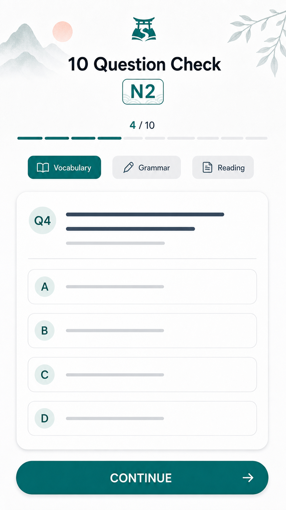

# N2 10問診断 下書き

| 項目 | 内容 |
| --- | --- |
| updated | 2026-05-26 |
| related | `docs/features.md#2-10-問診断` |

## 画面イメージ

## 目的

オンボーディング直後に、N2 学習計画を作るための仮診断を行う。

## 対象ユーザー

- 対象レベル: JLPT N2
- 利用前提: オンボーディング質問を完了している

## ユーザーフロー

1. プロフィール質問完了後に10問診断を開始する。
2. 画面上部に診断説明と `1/10` 形式の進捗を固定表示する。
3. 1問ずつ回答し、画面下部の `CONTINUE` で次へ進む。
4. 10問完了後に仮の現在地、弱点候補、初日のおすすめを表示する。
5. Home へ進む。

## 画面/状態

| 画面または状態 | 主アクション | 表示内容 | 遷移先 |
| --- | --- | --- | --- |
| 診断開始 | `始める` | 10問で確認する説明 | 問題1 |
| 問題 | `CONTINUE` | 問題文、選択肢、進捗 | 次の問題 |
| 結果 | `Homeへ` | 仮レベル、弱点、今日のおすすめ | Home |

含める状態:

- ローディング: 問題セット取得中。
- 空状態: 診断問題がない場合は開始できない説明を出す。
- 成功: 結果と初期計画を保存する。
- エラー: 保存失敗時はローカル再試行。
- オフライン: 同梱問題で実施可能。
- 権限不足: なし。

## データ要件

| データ | 型/形式 | 必須 | 説明 |
| --- | --- | --- | --- |
| diagnosticId | string | yes | 診断セッションID |
| questionIds | string[] | yes | 10問のID |
| answers | DiagnosticAnswer[] | yes | 回答、正誤、回答時間 |
| weaknessTags | string[] | yes | N2大問タグ |
| provisionalBand | `low` / `mid` / `high` | yes | 仮の現在地 |

出題構成は、文字・語彙4問、文法3問、短い読解3問。Zod では10問ちょうどであること、回答が選択肢内であることを検証する。

## API/Firebase 要件

初回リリースは同梱問題とローカル保存を基本にする。後続で Firestore `users/{userId}/diagnostics/{diagnosticId}` へ同期できる形にする。React Query key は `["diagnostic", "n2", guestId]`。

## コンテンツ要件

- 公式過去問や第三者問題をコピーしない。
- 問題は N2 形式に合わせたオリジナル作問にする。
- すべての問題に `sourceKind`, `sourceReference`, `copyrightNote`, `reviewStatus` を持たせる。

## エッジケース

- 未ログイン: ゲストIDで保存する。
- データ未作成: 診断問題セットを同梱データから作る。
- 通信失敗: 同梱問題で継続する。
- 途中離脱: 回答済み位置から再開する。
- 重複送信: 回答中のボタンを無効化する。
- 端末変更: 初回リリースでは引き継がない。

## 実装対象外

- 聴解問題。
- 完全な適応式テスト。
- 診断直後の合格可能性パーセント表示。

## 受け入れ条件

- [ ] 10問を必ず完了してからHomeへ進む。
- [ ] 旧診断仕様の文言が残っていない。
- [ ] 診断後に仮の弱点タグと初期計画が作られる。

## 確認すべき質問

- 未定。
