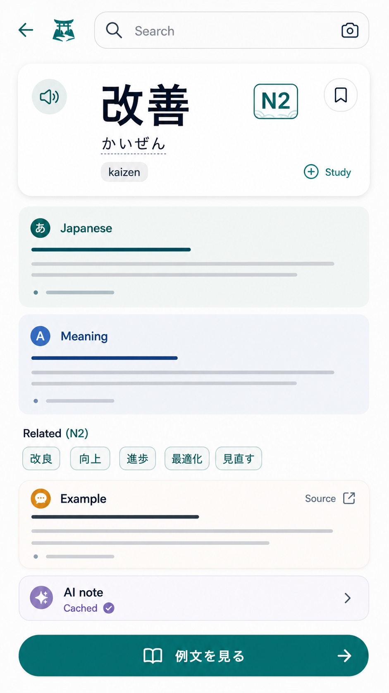

# 辞書 下書き

| 項目 | 内容 |
| --- | --- |
| updated | 2026-05-26 |
| related | `docs/features.md#4-辞書` |

## 画面イメージ

## 目的

N2 学習中に語彙、漢字、例文をすぐ確認できるようにする。

## 対象ユーザー

- 対象レベル: JLPT N2
- 利用前提: ゲストまたは後続ログインユーザー

## ユーザーフロー

1. Homeまたは辞書タブから検索する。
2. 同梱日本語キャッシュから見出し語とJLPTレベルを表示する。
3. 英語説明やAI補足が共有キャッシュにあれば表示する。
4. 共有キャッシュがなければ Firebase Functions 経由で生成し、保存後に表示する。
5. Wikipedia例文がある場合は出典つきで表示する。

## 画面/状態

| 画面または状態 | 主アクション | 表示内容 | 遷移先 |
| --- | --- | --- | --- |
| 検索 | 検索 | 入力、候補 | 結果 |
| 結果 | `例文を見る` | 定義、JLPTレベル、説明、例文 | 例文 |
| なし | `別の言葉を探す` | 見つからない説明 | 検索 |

含める状態:

- ローディング: 共有キャッシュ取得中。
- 空状態: 検索語未入力。
- 成功: 定義と出典を表示。
- エラー: AI生成に失敗しても日本語定義は表示する。
- オフライン: 同梱日本語キャッシュのみ表示する。
- 権限不足: AI生成上限時は既存キャッシュだけ表示する。

## データ要件

| データ | 型/形式 | 必須 | 説明 |
| --- | --- | --- | --- |
| headword | string | yes | 見出し語 |
| reading | string | no | 読み |
| jlptLevel | `N2` | yes | 対象レベル |
| japaneseDefinition | string | yes | 同梱定義 |
| englishDefinition | string | no | 共有AIキャッシュ |
| examples | object[] | no | 例文と出典 |
| generatedCacheKey | string | no | 共有キャッシュキー |

## API/Firebase 要件

- Functions: `dictionaryExplain`。入力は正規化済み見出し語、読み、対象言語、生成種別。
- Firestore: `dictionaryGeneratedCache/{cacheKey}` を read/write。
- React Query keys: `["dictionary", normalizedQuery]`, `["dictionaryGeneratedCache", cacheKey]`。

## コンテンツ要件

- 日本語定義とJLPTレベルは端末同梱キャッシュにする。
- Wikipedia例文は短い使用例、記事名、URL、取得日時、ライセンス/出典表示を持つ。
- Wikipedia本文を問題文として流用しない。

## エッジケース

- 未ログイン: ゲストでも検索可能。
- データ未作成: 見つからない状態を表示。
- 通信失敗: 同梱日本語定義だけ表示。
- 途中離脱: 検索履歴は任意保存。
- 重複送信: 同じ検索の同時生成を抑止する。
- 端末変更: 共有キャッシュは後続同期で再取得可能。

## 実装対象外

- 全言語のUI翻訳。
- 大規模な全文ローカル辞書。
- Wikipedia本文の問題化。

## 受け入れ条件

- [ ] 日本語定義とJLPTレベルがオフラインでも表示される。
- [ ] AI補足はFunctions経由で、共有キャッシュを優先する。
- [ ] 例文には出典表示がある。

## 確認すべき質問

- 未定。
