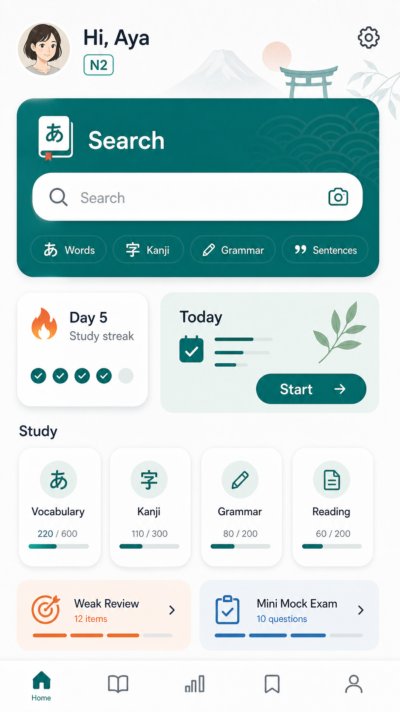

# Home 下書き

| 項目 | 内容 |
| --- | --- |
| updated | 2026-05-26 |
| related | `docs/features.md#3-home` |

## 画面イメージ

## 目的

辞書検索を主役にしつつ、今日のN2学習へ迷わず戻れる画面にする。

## 対象ユーザー

- 対象レベル: JLPT N2
- 利用前提: オンボーディングと10問診断を完了している

## ユーザーフロー

1. Homeを開く。
2. 固定ヘッダーでユーザー名と設定導線を確認する。
3. 辞書検索、今日のおすすめ、弱点復習、ミニ模試のいずれかへ進む。

## 画面/状態

| 画面または状態 | 主アクション | 表示内容 | 遷移先 |
| --- | --- | --- | --- |
| 通常 | 辞書検索 | ヘッダー、検索、streak、今日のおすすめ | 辞書 / Learn |
| 今日の学習あり | `始める` | おすすめカード | 演習 |
| 今日の学習完了 | `復習する` | streak、完了表示、次の提案 | 弱点復習 |

含める状態:

- ローディング: 学習状態取得中のSkeleton。
- 空状態: 診断未完了なら診断へ戻す。
- 成功: 学習状態を表示する。
- エラー: ローカル状態から復旧する。
- オフライン: 保存済み状態と辞書同梱データを使う。
- 権限不足: なし。

## データ要件

| データ | 型/形式 | 必須 | 説明 |
| --- | --- | --- | --- |
| displayName | string | yes | 挨拶表示 |
| streakDays | number | yes | 継続日数 |
| dailyRecommendation | object | yes | 今日のおすすめ |
| pendingWeaknessCount | number | yes | 復習候補数 |

## API/Firebase 要件

React Query key は `["home", guestId]`。初回リリースはローカル保存から組み立て、後続で Firestore `users/{userId}/learningState` と同期する。

## コンテンツ要件

Homeでは問題本文を直接表示しない。カードにはカテゴリ、進捗、アイコン、短い説明だけを表示する。

## エッジケース

- 未ログイン: ゲスト状態で表示する。
- データ未作成: オンボーディングまたは診断へ戻す。
- 通信失敗: ローカル保存で表示する。
- 途中離脱: 最後の未完了タスクをおすすめに出す。
- 重複送信: カード押下中は二重遷移を防ぐ。
- 端末変更: 初回リリースでは引き継がない。

## 実装対象外

- 複雑な分析ダッシュボード。
- ランキング。
- 進学・就職ゴール管理。

## 受け入れ条件

- [ ] 固定ヘッダーにユーザーアイコン、挨拶、設定アイコンがある。
- [ ] 辞書検索がHomeの最上位にある。
- [ ] 文字量を抑え、カードとアイコンで理解できる。

## 確認すべき質問

- 未定。
