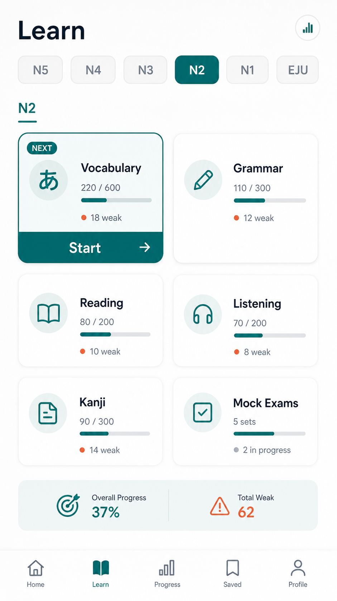

# Learn N2タブ 下書き

| 項目 | 内容 |
| --- | --- |
| updated | 2026-05-26 |
| related | `docs/features.md#5-learn` |

## 画面イメージ

## 目的

N2 の大問ごとに学習を選べる画面を作り、N2 以外は将来導線として準備中表示にする。

## 対象ユーザー

- 対象レベル: JLPT N2
- 利用前提: 10問診断完了後

## ユーザーフロー

1. Learnタブを開く。
2. 上部の `N5 / N4 / N3 / N2 / N1 / EJU` タブを見る。
3. `N2` では大問カードを選ぶ。
4. N2以外では準備中画面を表示し、N2へ戻れるようにする。

## 画面/状態

| 画面または状態 | 主アクション | 表示内容 | 遷移先 |
| --- | --- | --- | --- |
| N2 | 大問を選ぶ | N2大問カード、進捗 | 演習 |
| N2以外 | `N2に戻る` | 準備中メッセージ | N2タブ |
| 空 | `Homeへ` | N2問題がない説明 | Home |

含める状態:

- ローディング: 大問進捗取得中。
- 空状態: N2コンテンツ未投入。
- 成功: 大問カードを表示。
- エラー: 進捗なしでもカードを表示。
- オフライン: 同梱N2メタデータで表示。
- 権限不足: なし。

## データ要件

| データ | 型/形式 | 必須 | 説明 |
| --- | --- | --- | --- |
| activeTab | `N5` / `N4` / `N3` / `N2` / `N1` / `EJU` | yes | 選択中タブ |
| sections | LearnSection[] | yes | N2大問 |
| sectionProgress | object | no | 完了率、弱点数 |

N2大問は、漢字読み、表記、語形成、文脈規定、言い換え類義、用法、文の文法1、文の文法2、文章の文法、内容理解短文、内容理解中文、統合理解、主張理解長文、情報検索を持つ。

## API/Firebase 要件

React Query key は `["learnSections", "N2", guestId]`。大問定義は同梱メタデータ、進捗はローカル学習状態から読む。

## コンテンツ要件

- [JLPT公式の試験科目と問題構成](https://www.jlpt.jp/guideline/testsections.html)を参照する。
- 公式問題文はコピーしない。
- N2以外とEJUには学習問題を出さない。

## エッジケース

- 未ログイン: ゲスト進捗で表示。
- データ未作成: 進捗0として表示。
- 通信失敗: 同梱メタデータで表示。
- 途中離脱: 最後に開いたN2大問を復元してよい。
- 重複送信: 大問カードの二重遷移を防ぐ。
- 端末変更: 初回リリースでは引き継がない。

## 実装対象外

- N2以外の実コンテンツ。
- EJUの実コンテンツ。
- 聴解。

## 受け入れ条件

- [ ] N2以外のタブは準備中を表示する。
- [ ] N2タブでは大問カードが表示される。
- [ ] 準備中画面からN2に戻れる。

## 確認すべき質問

- 未定。
