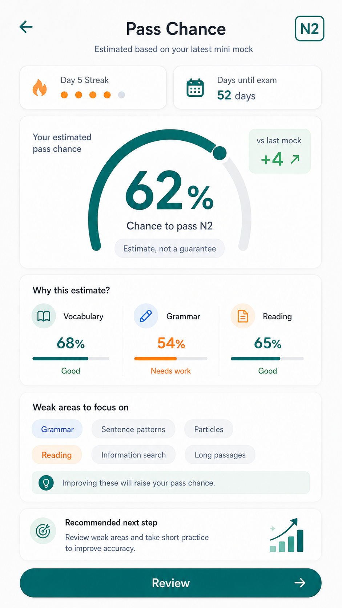

# N2合格可能性 下書き

| 項目 | 内容 |
| --- | --- |
| updated | 2026-05-26 |
| related | `docs/features.md#10-合格可能性更新` |

## 画面イメージ

## 目的

ミニ模試後に、N2合格可能性と次に伸ばすべき行動を短く表示する。

## 対象ユーザー

- 対象レベル: JLPT N2
- 利用前提: ミニ模試を1回以上完了している

## ユーザーフロー

1. ミニ模試を完了する。
2. スコア、弱点、継続状況、試験日までの日数から合格可能性を計算する。
3. パーセントと次の改善アクションを表示する。
4. Homeの今日のおすすめに反映する。

## 画面/状態

| 画面または状態 | 主アクション | 表示内容 | 遷移先 |
| --- | --- | --- | --- |
| 初回未計算 | `ミニ模試へ` | まだ表示しない説明 | ミニ模試 |
| 計算済み | `復習する` | 合格可能性、理由、次の提案 | 弱点復習 |
| 更新後 | `続ける` | 前回との差分 | Home |

含める状態: ローディング、空状態、成功、エラー、オフライン、権限不足。

## データ要件

| データ | 型/形式 | 必須 | 説明 |
| --- | --- | --- | --- |
| probability | number | yes | 0〜100 |
| mockExamScore | number | yes | 直近ミニ模試結果 |
| sectionScores | object | yes | 分野別結果 |
| activeWeaknesses | string[] | yes | 未解消弱点 |
| streakDays | number | yes | 継続日数 |
| daysUntilExam | number | yes | 試験日までの日数 |
| nextAction | string | yes | 次の改善アクション |

## API/Firebase 要件

初回リリースではルールベースでローカル計算する。後続同期先は `users/{userId}/predictions/{predictionId}`。React Query key は `["passProbability", guestId]`。

## コンテンツ要件

合格可能性は短い診断では表示しない。ミニ模試後のみ表示する。

## エッジケース

- 未ログイン: ゲスト保存。
- データ未作成: ミニ模試へ誘導。
- 通信失敗: ローカル計算で表示。
- 途中離脱: 完了済みミニ模試だけ使う。
- 重複送信: 同じ模試結果で重複計算しない。
- 端末変更: 初回リリースでは引き継がない。

## 実装対象外

- 機械学習モデル。
- N2以外の予測。
- 合否保証のように見える表現。

## 受け入れ条件

- [ ] 10問診断直後には表示しない。
- [ ] ミニ模試後にパーセントと次の行動を表示する。
- [ ] 数値だけでなく理由を短く表示する。

## 確認すべき質問

- 未定。
