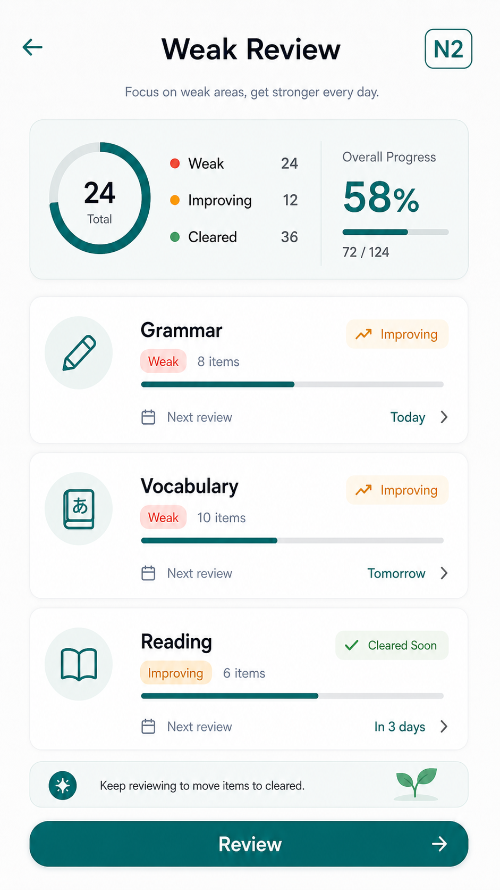

# N2弱点復習 下書き

| 項目 | 内容 |
| --- | --- |
| updated | 2026-05-26 |
| related | `docs/features.md#8-弱点復習` |

## 画面イメージ

## 目的

誤答、低自信、同タグの連続ミスから、N2大問タグ単位の弱点復習を作る。

## 対象ユーザー

- 対象レベル: JLPT N2
- 利用前提: 演習履歴がある

## ユーザーフロー

1. 演習結果から弱点候補を更新する。
2. Homeまたは今日の計画から弱点復習を始める。
3. 対象タグの問題を解く。
4. 復習結果で弱点状態を更新する。

## 画面/状態

| 画面または状態 | 主アクション | 表示内容 | 遷移先 |
| --- | --- | --- | --- |
| 弱点一覧 | `復習する` | 弱点タグ、件数、進捗 | 復習問題 |
| 復習問題 | `回答する` | 問題、進捗 | 解説 |
| 完了 | `続ける` | 改善したタグ、次の提案 | Home |

含める状態: ローディング、空状態、成功、エラー、オフライン、権限不足。

## データ要件

| データ | 型/形式 | 必須 | 説明 |
| --- | --- | --- | --- |
| weaknessTag | string | yes | N2大問タグ |
| mistakeCount | number | yes | 誤答数 |
| lowConfidenceCount | number | yes | 低自信数 |
| dueAt | ISO date | yes | 次回復習予定 |
| status | `active` / `improving` / `cleared` | yes | 弱点状態 |

## API/Firebase 要件

React Query key は `["weaknesses", guestId]`。後続同期先は `users/{userId}/weaknesses/{tag}`。

## コンテンツ要件

復習問題はレビュー済みN2問題のみ使う。N2以外のタグは作らない。

## エッジケース

- 未ログイン: ゲスト保存。
- データ未作成: 弱点なし状態を表示。
- 通信失敗: ローカル履歴で表示。
- 途中離脱: 復習セッションを保持。
- 重複送信: 弱点更新を冪等にする。
- 端末変更: 初回リリースでは引き継がない。

## 実装対象外

- AIによる弱点自動命名。
- N2以外の弱点復習。
- 先生向けレポート。

## 受け入れ条件

- [ ] 誤答、低自信、連続ミスで弱点候補が増える。
- [ ] 弱点タグがN2大問タグに紐づく。
- [ ] 復習完了後に状態が更新される。

## 確認すべき質問

- 未定。
